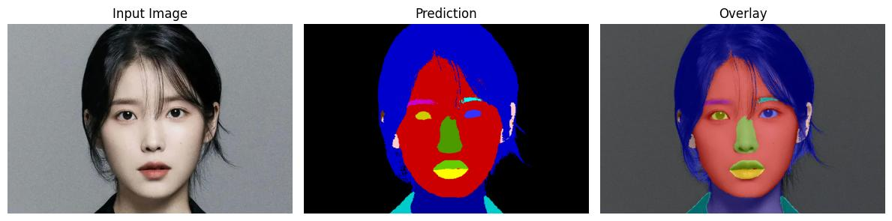
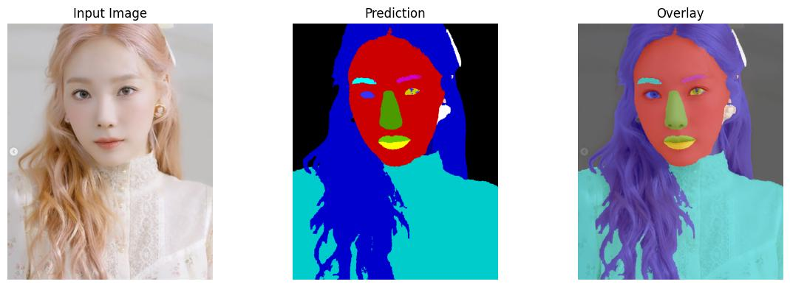
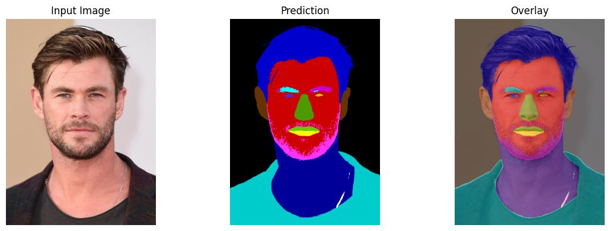

# Face Parsing

A face parsing model that combines VGG19 CNN features with DINOv3 visual representations for accurate facial segmentation.


<p align="center">
  
  
  
</p>

This example is the output of 19 face labels model. 

## Model Architecture

This model uses a dual-encoder architecture:
- **CNN Encoder**: VGG19 backbone for multi-scale feature extraction
- **Vision Transformer**: DINOv3 (ViT-B/16) for semantic feature extraction
- **Decoder**: Custom decoder that fuses features from both encoders

## Weights

### DINOv3 Weights
The DINOv3 weights (`dinov3_vitb16_pretrain_lvd1689m-73cec8be.pth`) are from the official DINOv3 repository and should be downloaded separately:
- Source: [Official DINOv3 Repository](https://github.com/facebookresearch/dinov3)
- Model: ViT-B/16 pretrained on LVD-1689M dataset
- Place the weights in: `checkpoints/dinov3_vitb16_pretrain_lvd1689m-73cec8be.pth`

### Decoder Weights
Only the [decoder weights](https://drive.google.com/drive/folders/1qvMJ418YFywkksFhPFsjldYpgBwOO8RH?usp=drive_link) are provided in this repository (`experiments/checkpoints/decoder.ckpt`). These weights include:
- Custom decoder layers
- VGG19 CNN encoder (pretrained and fine-tuned)
- All training-specific parameters

The DINOv3 encoder is loaded separately to keep the checkpoint size manageable and respect the original model distribution.

## Face Parsing Labels

The **19-class face parsing scheme** provides detailed segmentation of facial components:

| Label | Class | Description |
|-------|-------|-------------|
| 0 | Background | Non-face regions |
| 1 | Skin | Face skin |
| 2 | Nose | Nose region |
| 3 | Right Eye | Right eye |
| 4 | Left Eye | Left eye |
| 5 | Right Brow | Right eyebrow |
| 6 | Left Brow | Left eyebrow |
| 7 | Right Ear | Right ear |
| 8 | Left Ear | Left ear |
| 9 | Mouth Interior | Inside of the mouth |
| 10 | Top Lip | Upper lip region |
| 11 | Bottom Lip | Lower lip region |
| 12 | Neck | Neck region |
| 13 | Hair | Hair region |
| 14 | Beard | Beard region |
| 15 | Clothing | Clothing |
| 16 | Glasses | Eyeglasses |
| 17 | Headwear | Hat, cap, etc. |
| 18 | Facewear | Face accessories |

## Project Structure

```
FaceParsing/
├── src/
│   ├── face_parsing/
│   │   ├── __init__.py               # Reusable inference helpers
│   │   └── predictor.py              # FaceParsingPredictor plug-and-play API
│   ├── models/
│   │   ├── __init__.py
│   │   ├── face_parsing_model.py      # PyTorch Lightning model
│   │   ├── encoder.py                 # VGG19 + DINOv3 encoder
│   │   └── decoder.py                 # Feature fusion decoder
│   ├── data/
│   │   ├── __init__.py
│   │   └── face_parsing_datamodule.py # Data loading and preprocessing
│   ├── configs/
│   │   └── default_config.yaml        # Default configuration
│   └── utils/
│       ├── __init__.py
│       ├── config_loader.py           # Configuration management
│       └── visualization.py           # Visualization utilities
├── experiments/
│   ├── logs/                          # TensorBoard logs
│   └── checkpoints/                   # Model checkpoints
│       └── decoder.ckpt               # Decoder-only checkpoint
├── checkpoints/
│   └── dinov3_vitb16_pretrain_lvd1689m-73cec8be.pth  # DINOv3 weights (download separately)
├── data/
│   ├── raw/                           # Raw dataset files
│   └── processed/                     # Processed data
├── train.py                           # Training script
├── inference.py                       # Inference script
├── extract_decoder_weights.py        # Script to extract decoder weights
├── requirements.txt                   # Dependencies
└── README.md
```

## Installation

```bash
pip install -r requirements.txt

# Ensure the repo is importable
export PYTHONPATH=$PYTHONPATH:/path/to/FaceParsing/src
```

## Usage

### Inference

Run inference on an image:
```bash
python inference.py --input_dir path/to/image.jpg \
                   --output_dir outputs/ \
                   --checkpoint experiments/checkpoints/decoder.ckpt \
                   --dinov3_checkpoint checkpoints/dinov3_vitb16_pretrain_lvd1689m-73cec8be.pth \
                   --batch_size 1
```

Run inference on a directory of images:
```bash
python inference.py --input_dir path/to/images/ \
                   --output_dir outputs/ \
                   --batch_size 16 \
                   --no_overlay          # optional flag to skip overlay export
```

#### FaceParsingPredictor (plug-and-play)

The CLI now wraps a reusable helper at `src/face_parsing/predictor.py` so other projects can import the network directly:

```python
from src.face_parsing import FaceParsingPredictor

predictor = FaceParsingPredictor(
    checkpoint_path="experiments/checkpoints/decoder.ckpt",
    dinov3_checkpoint_path="checkpoints/dinov3_vitb16_pretrain_lvd1689m-73cec8be.pth",
    device="cuda",           # automatically falls back to CPU
    image_size=(512, 512),
)

result = predictor.predict("/path/to/image.jpg")
mask = result.numpy_mask()  # uint8 array ready for downstream tasks
```

Key APIs:
- `predict(image, resize_to_original=True, output_device="cpu")`
- `predict_batch(images, resize_to_original=True, output_device="cpu")`
- `predict_directory(input_dir, output_dir, batch_size=4, save_overlay=True)`

The helper accepts file paths, `PIL.Image`, `numpy.ndarray`, or `torch.Tensor` inputs and returns structured `FaceParsingSingleResult` objects containing masks, probabilities, and metadata.

### Extract Decoder Weights (if using full checkpoint)
If you have a full checkpoint (`last.ckpt`) that includes DINOv3 weights, extract the decoder-only weights:

```bash
python extract_decoder_weights.py --checkpoint experiments/checkpoints/last.ckpt \
                                  --output experiments/checkpoints/decoder.ckpt
```

### Command Line Arguments

- `--input_dir`: Path to input image or directory
- `--output_dir`: Path to output directory (default: `./outputs`)
- `--checkpoint`: Path to decoder checkpoint (default: `experiments/checkpoints/decoder.ckpt`)
- `--dinov3_checkpoint`: Path to DINOv3 checkpoint (default: `checkpoints/dinov3_vitb16_pretrain_lvd1689m-73cec8be.pth`)
- `--device`: Device to run on (`cuda` or `cpu`)
- `--image_size`: Input image size as height width (default: 512 512)
- `--batch_size`: Number of images processed per batch (default: 16)
- `--save_overlay`: Save overlay visualization (enabled by default)
- `--no_overlay`: Disable overlay visualization
- `--alpha`: Transparency for overlay visualization (default: 0.5)

## Output

The model generates:
- `*_mask.png`: Raw segmentation mask (class indices per pixel)
- `*_overlay.jpg`: Visualization overlay (if `--save_overlay` is used)

## Training

For training details, refer to the training scripts in the repository. The model uses:
- PyTorch Lightning for training orchestration
- Cross-entropy loss with optional auxiliary losses
- AdamW optimizer with cosine annealing scheduler

### Training Command

```bash
python train.py \
    --data_dir ./data \
    --batch_size 8 \
    --max_epochs 100 \
    --gpus 1
```

## Features

- **Modular Architecture**: Clean separation between model, data, and training logic
- **Dual Encoder Design**: Combines CNN and Vision Transformer features
- **PyTorch Lightning**: Leverages Lightning for training loop abstraction
- **Configuration Management**: YAML-based configuration system
- **Visualization Tools**: Built-in visualization for predictions and results
- **Flexible Data Pipeline**: Easily extensible data module with augmentation support
- **Inference Pipeline**: Ready-to-use inference script for single images or directories

## Citation

If you use this model, please cite:
- Original DINOv3 paper for the vision transformer encoder
- This repository for the face parsing implementation

## License
DINOv3 weights are subject to the original Meta AI license terms.
